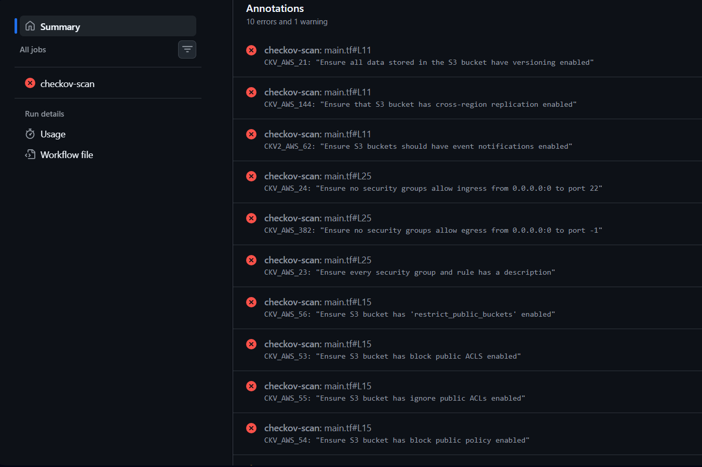
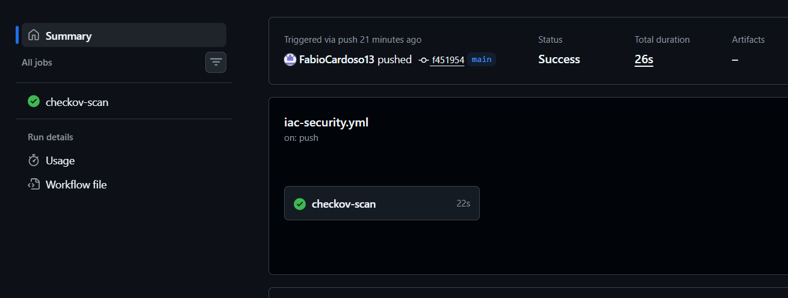

# DevSecOps: Infrastructure as Code (IaC) Security Pipeline

## About the Project
This project focuses on securing Infrastructure as Code (IaC) by implementing a "Shift-Left" security approach. Using Terraform and Checkov, the goal was to identify and remediate cloud infrastructure misconfigurations before they are deployed. 

The project demonstrates the ability to build automated Quality Gates within a CI/CD pipeline, ensuring that all infrastructure modifications adhere to strict security baselines and enterprise compliance frameworks.

## Technologies & Tools Used
* **Infrastructure as Code:** Terraform
* **Static Analysis / IaC Scanning:** Checkov
* **Cloud Emulation (Local Testing):** LocalStack
* **CI/CD Automation:** GitHub Actions

## Architecture & Security Workflow

The pipeline is triggered automatically on every repository push. The workflow follows these steps:
1. **Code Checkout:** Retrieves the latest Terraform configuration (`.tf` files).
2. **IaC Security Scan (Checkov):** Analyzes the code against hundreds of AWS best practices and compliance policies (CIS, SOC2, HIPAA).
3. **Quality Gate Enforcement:** If critical misconfigurations are detected, the pipeline fails, blocking the deployment.
4. **Remediation & Exception Management:** Vulnerabilities are fixed in code, and acceptable risks are documented using inline suppressions with clear engineering justifications.

## Attack Surface & Automated Remediation

The initial infrastructure was deliberately configured with common high-risk vulnerabilities. The pipeline successfully blocked the deployment until the following remediations were applied:

### 1. S3 Bucket Security
* **Vulnerability:** An S3 bucket was created with public access enabled and no encryption, exposing sensitive data to the internet.
* **Remediation:** 
  * Enforced `aws_s3_bucket_public_access_block` to entirely disable public ACLs and policies.
  * Implemented Server-Side Encryption (SSE-KMS) as the default behavior using a dedicated KMS Key.
  * Enabled Bucket Versioning to protect against accidental deletion or ransomware.

### 2. Network Security (Security Groups)
* **Vulnerability:** A Security Group was configured to allow inbound SSH traffic (port 22) from the entire internet (`0.0.0.0/0`).
* **Remediation:** Restricted ingress traffic exclusively to a simulated internal administrative network (`10.0.0.0/8`). Added descriptions to all rules for better auditability.

### 3. Risk Acceptance & Suppressions
* Demonstrated maturity in handling false positives and architectural constraints by documenting inline suppressions (e.g., bypassing cross-region replication warnings for a localized mock environment).

## Pipeline Execution Evidence

*The GitHub Actions workflow successfully enforcing the Checkov Quality Gate:*

## Key Takeaways
This project validates the critical importance of DevSecOps in cloud engineering. By treating infrastructure as code, we can apply the same rigorous security testing used in software development directly to our cloud environments, ensuring a secure-by-default architecture.
